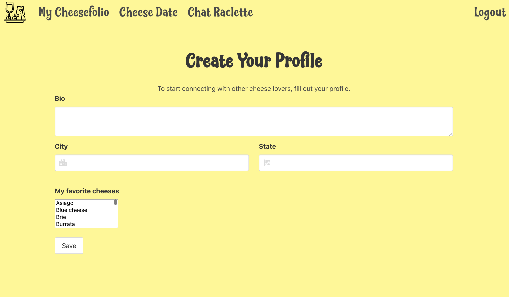
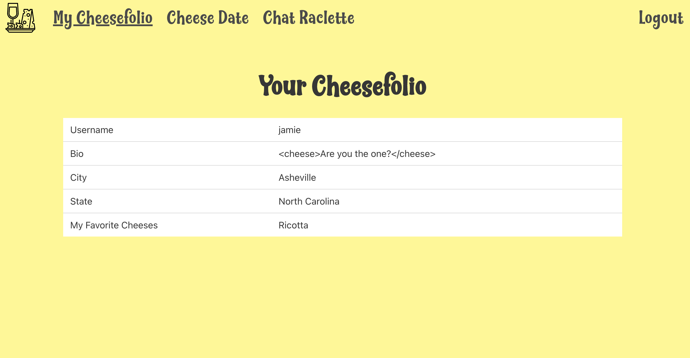
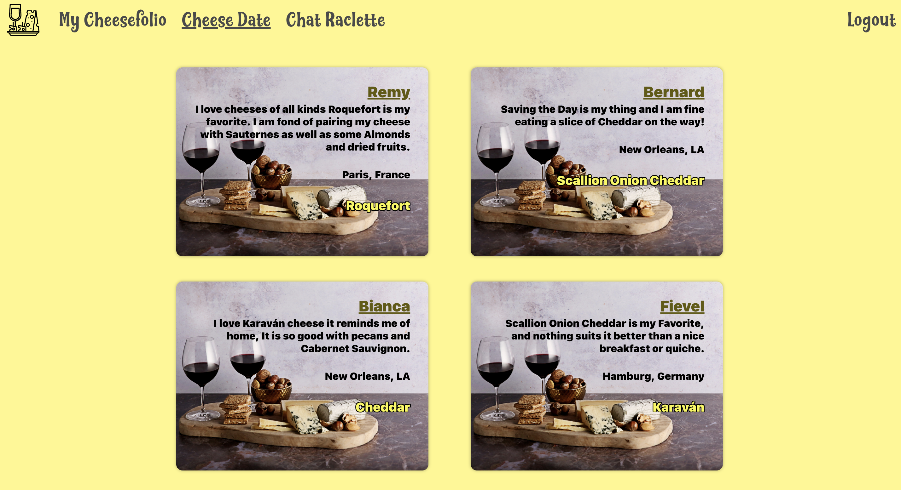
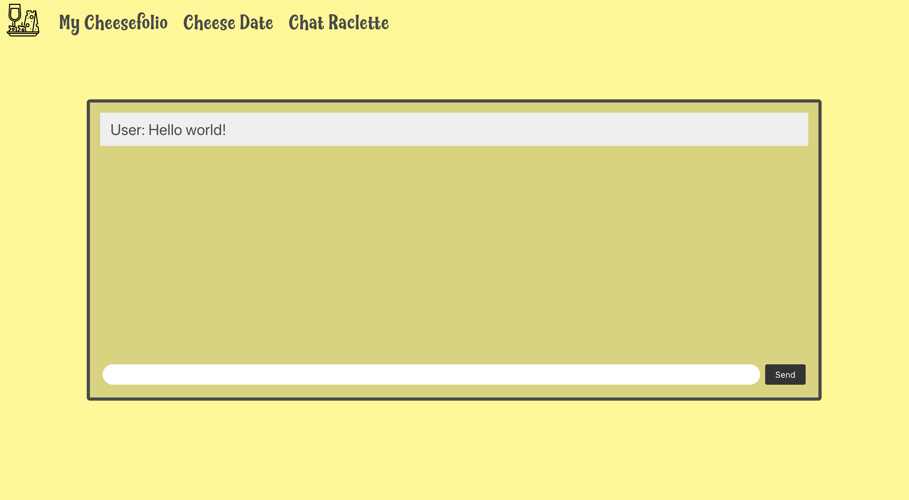
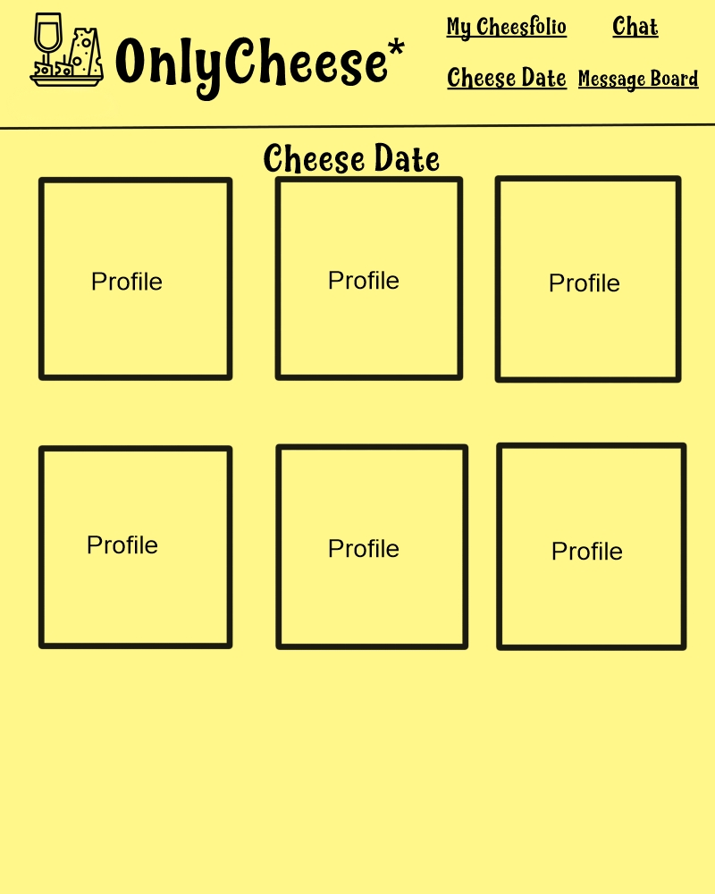
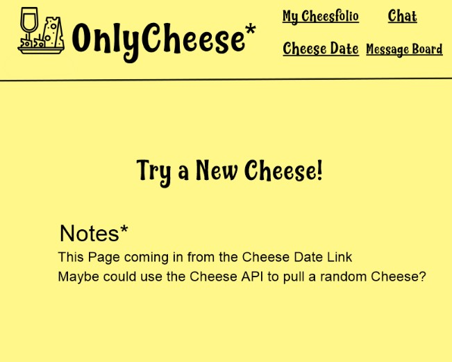
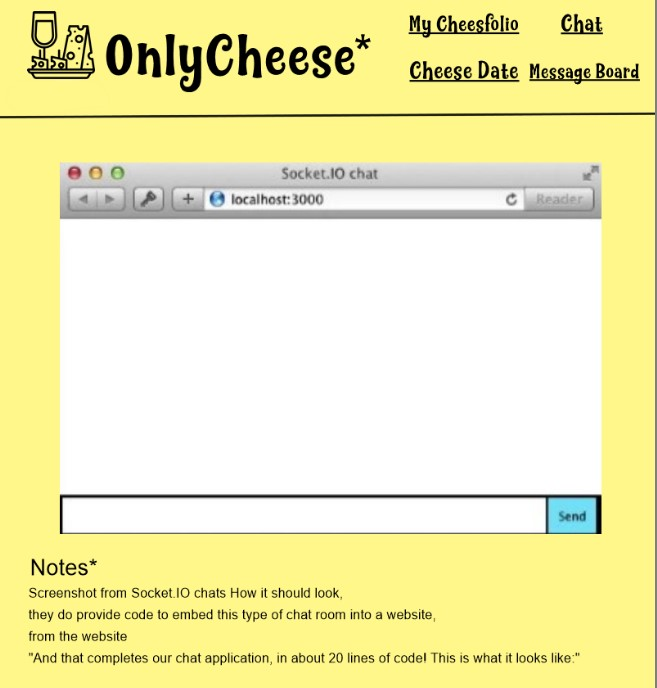
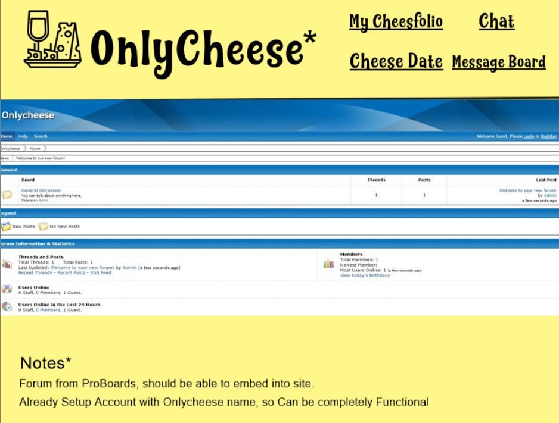

 
# OnlyCheese 

## Table of Contents 

- [Description](#description)
- [Usage](#usage)
- [Wireframe](#wireframe)
- [Authors](#authors)
- [Acknowledgements](#acknowledgements)

## Description
 
A full stack JavaScript dating site application based on cheese preferences.   
Users can sign up, create a profile, and meet their match.

Front End: 
- Javascript
- HTML
- CSS
- Bulma

Back End: 

- Express
- Handlebars
- Sequelize
- Bcrypt
- Dotenv
- Mysql2
- Socket.io
- Heroku

## Usage

To access the app visit the following url:             
[OnlyCheese](https://only-cheese.herokuapp.com/ )   
 https://only-cheese.herokuapp.com/    
 
 1. Welcome to OnlyCheese!
  
 1. Login in with your credentials.
  
 1. Otherwise sign up to create an account with username, email and password.
  
 1. You will then be prompted to create a user profile with your bio, city, 
 state and favorite cheese.
  
 1. Once complete you're able to view your user profile information on the  Cheesefolio page.
  
 1. On the Cheese Date page you can view a gallery of other users.
  
 1. And finally you can enter the Chat Raclette chatroom here.
  

## Wireframe

## Authors
- [Eileen Harvey](https://github.com/eileenmh)
- [Damar Ellis](https://github.com/DLEllis07)
- [Taylor Green](https://github.com/taylor-green)
- [Adam Johnson](https://github.com/AJoelj84)
- [Jamie Nadel](https://github.com/bnadel4)

## Acknowledgements

[https://opensource.org/licenses/](https://opensource.org/licenses/)
